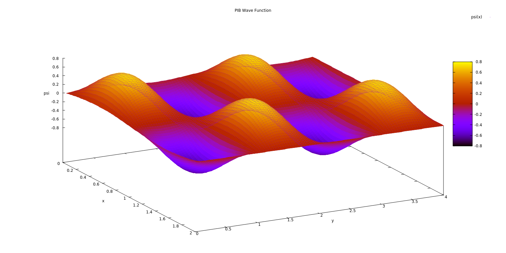
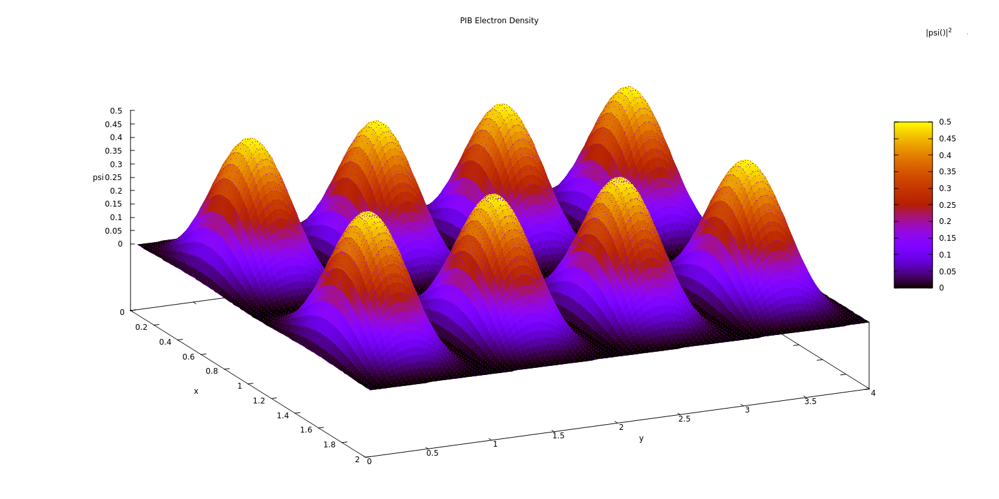

# Particle in Box in Fortran
It's a tool used to model the particle in a box model in quantum mechanics using `fortran` as the main solver for the problem and `GNUPlot` for creating plots and reports.

## Install
compile the `src` to create and executable
```
$ make all
```
run the executable file `PIB.exe` in `exec` folder
```
$ make run
```
this command will generate a `data.dat` file containing the the solution with this structure.
```
   1.9999999E-004   3.9999998E-004   1.9999999E-004   8.7698928E-010   7.6911020E-019
   3.9999998E-004   7.9999997E-004   3.9999998E-004   7.0158986E-009   4.9222834E-017
   5.9999997E-004   1.1999999E-003   5.9999997E-004   2.3678568E-008   5.6067461E-016
   ...
   9.9999993E-004   1.9999998E-003   9.9999993E-004   1.0962169E-007   1.2016916E-014
   1.1999999E-003   2.3999998E-003   1.1999999E-003   1.8942476E-007   3.5881741E-014
```

as `x`, `y`, `z`, `psi`, `density`

## Generate Plot
```
$ gnuplot -persist -e "dim=100" plot.gn
```
this step requires installing `gnuplot` in my case on `linux` just use 
```
$ sudo apt install gnuplot
```

## Example
### Wave Function


### Electron Density



## Note
You can change the parameters in the `src/parameters.f95` to change the environment of the box.
