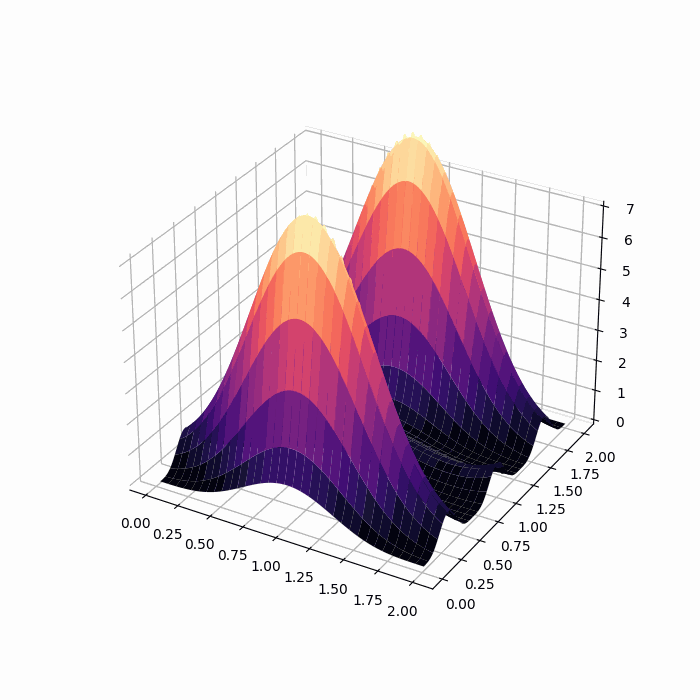

# Particle in Box in Fortran
It's a tool used to model the particle in a box model in quantum mechanics using `fortran` as the main solver for the problem and `Python` to visualize the generated data.

## Install
compile the `src` to create and executable using
```
$ make all
```
run the executable file `PIB.exe` in `exec` folder
```
$ make run
```
this command will generate a `result.nc` file containing the the solution with this structure.
which contains a all the data including the `xx`, `yy`, `psi` and `den` which are respectivly
the x-grid, y-grid, wavefunction and the density.

## Generate Plot
```sh
$ python scripts/reader.py
```
Python will need the following packages to work
 1. NumPY
 2. Matplotlib
 3. netCDF4
which can be all found in `anaconda` distribution

## Example
### Wave Function



## Note
You can change the parameters in the `src/parameters.f95` to change the environment of the box.
